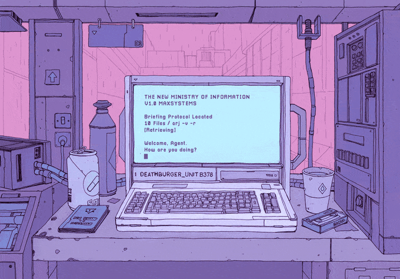

<h1 align="center">
  
</h1>

<p align="center">
  
</p>

<p align="center">
    <h1  align="center" > 𝙷𝚎𝚢 𝚝𝚑𝚎𝚛𝚎, 𝙸'𝚖 𝙱𝚛í𝚍! </h1> 
    <h4 align="center"> 𝚁𝚎𝚖𝚘𝚝𝚎 𝙳𝚊𝚝𝚊 𝙴𝚗𝚐𝚒𝚗𝚎𝚎𝚛 𝚌𝚞𝚛𝚛𝚎𝚗𝚝𝚕𝚢 𝚠𝚘𝚛𝚔𝚒𝚗𝚐 𝚊𝚝 𝙶𝚕𝚘𝚏𝚘𝚡 🦊 𝙶𝚒𝚟𝚒𝚗𝚐 𝚌𝚞𝚜𝚝𝚘𝚖𝚎𝚛𝚜 𝚒𝚗𝚜𝚒𝚐𝚑𝚝𝚜 𝚒𝚗𝚝𝚘 𝚝𝚑𝚎𝚒𝚛 𝙶𝚢𝚖𝚜 𝚊𝚗𝚍 𝙱𝚞𝚜𝚒𝚗𝚎𝚜𝚜𝚎𝚜 𝚠𝚒𝚝𝚑 𝙰𝚗𝚊𝚕𝚢𝚝𝚒𝚌𝚜 𝚊𝚗𝚍 𝙱𝚒𝚐 𝙳𝚊𝚝𝚊 𝚜𝚘𝚕𝚞𝚝𝚒𝚘𝚗𝚜 📈 </h4>
</p>

<p align="center">
    <h3  align="center" > 𝙽𝚊𝚝𝚒𝚘𝚗𝚊𝚕𝚒𝚝𝚢: 𝙸𝚛𝚒𝚜𝚑 ☘️ </h1> 
    <h3  align="center" > 𝙿𝚎𝚛𝚜𝚘𝚗𝚊𝚕 𝙸𝚗𝚝𝚎𝚛𝚎𝚜𝚝𝚜: 🎞️📷🕹️🎸💿🏃👩‍🍳 </h1> 
    <h3  align="center" > 𝙲𝚘𝚞𝚗𝚝𝚛𝚒𝚎𝚜 𝚅𝚒𝚜𝚒𝚝𝚎𝚍: 🇵🇭, 🇸🇬, 🇨🇳, 🇬🇧, 🇺🇸, 🇳🇱, 🇫🇷  </h1> 
    <h3  align="center" > 𝙲𝚞𝚛𝚛𝚎𝚗𝚝 𝙻𝚘𝚌𝚊𝚝𝚒𝚘𝚗: 📍 𝙲𝚘𝚛𝚔, 𝙼𝚞𝚗𝚜𝚝𝚎𝚛, 𝙸𝚛𝚎𝚕𝚊𝚗𝚍 🇮🇪 </h1> 
</p>

 

```javascript
const brid = {
    pronouns: "She" | "Her",
    code: ["Python", "SQL", "Javascript"],
    askMeAbout: ["data engineering", "big data", "data ops", "photography", 'fitness', 'cooking'],
    technologies: {
        databases: ["Redshift", "Cassandra", "Firebase", "MySql"],
        etl: {
            frameworks: ["Airflow", "Glue", "DBT"]
        },
        ingestion: {
            frameworks: ["Stitch", "Fivetran", "AWS Kinesis", "AWS Firehose"]
        },
        devOps: ["AWS", "Docker🐳"],
        misc: ["Looker", "Notion Builder", "Postman API Collections", "Jupyter Notebooks"]
    },
    architecture: ["Data Lake Architecture", "Extract Transform Load Pipelines", "Big Data Architecture"],
    currentFocus: "Building Analytics solutions to give customers valuable insight into their business",
    joke: "A SQL query walks into a bar, approaches two tables and asks 'Can I join you?'"
};
```


### 🌎 𝙲𝚑𝚎𝚌𝚔 𝚖𝚢 𝚠𝚎𝚋𝚜𝚒𝚝𝚎: bridmoynihan.me

<div style="padding: 25px 0;">
    <a href="https://twitter.com/brid_moynihan" style="padding: 8px; width: 24px; height: 24px;">
        
    </a>
    <a href="https://www.instagram.com/moynihanbrid/" style="padding: 8px; width: 24px; height: 24px;">
        
    </a>
     <a href="https://www.linkedin.com/in/br%C3%ADd-m-0300b516b/" style="padding: 8px; width: 24px; height: 24px;">
        
    </a>
    <a href="https://bridmoynihan.medium.com/" style="padding: 8px; width: 24px; height: 24px;">
        
    </a>
    <a href="https://www.npmjs.com/~b-moynihan" style="padding: 8px; width: 24px; height: 24px;">
        
    </a>
</div>
